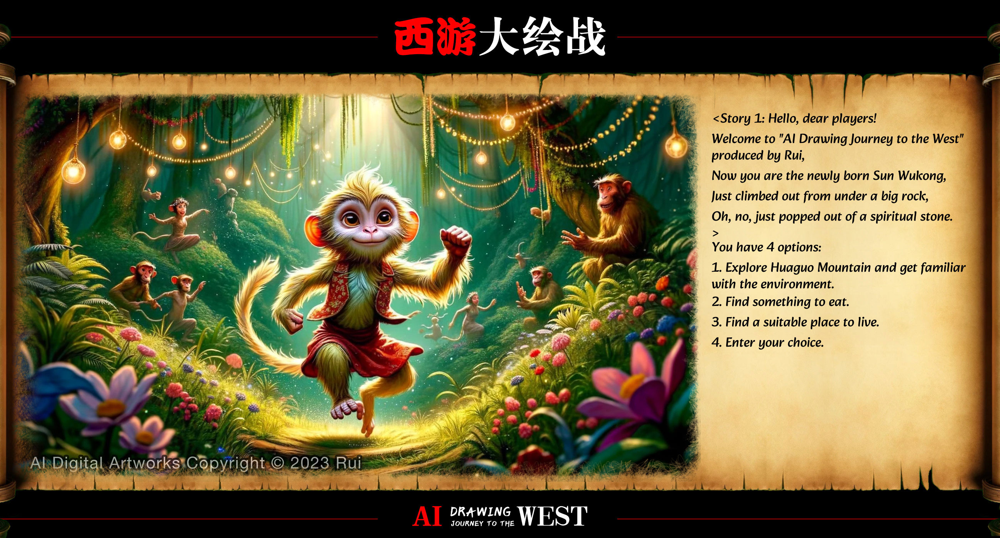

# awesome-comfyui-workflow

#### AI Dialogue Game <Journey to the West>

  

Author：[rui40000](https://github.com/rui40000)

You can build an interactive, real-time dialogue game in ComfyUI with the theme of the Chinese mythological story "Journey to the West." You play as the newly born Monkey King, Sun Wukong.

[🔗DOWNLOAD](./workflow/ai-dialogue-game-journey-to-the-west-v1.json)

#### Real-time design

  

Author：[shadowcz007](https://github.com/shadowcz007)

Real-time capturing of screen video stream from any software and generating new images using LCM.

[🔗DOWNLOAD](./workflow/real-time-design-v1.json)