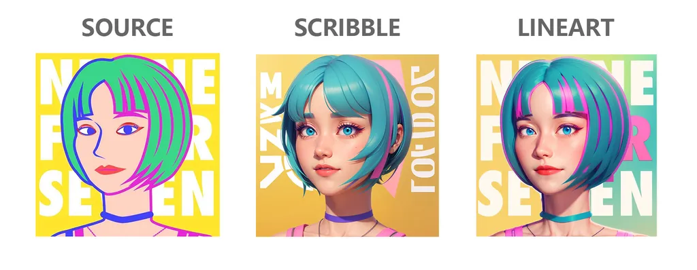

#### Easy-2D-to-3D

  

Author：[seven947](https://www.xiaohongshu.com/user/profile/607e4be40000000001004cf7)

This workflow can turn your flat illustration into a 3D image without entering any prompt word.

[🔗DOWNLOAD](./easy-2d-to-3d-v1.json)