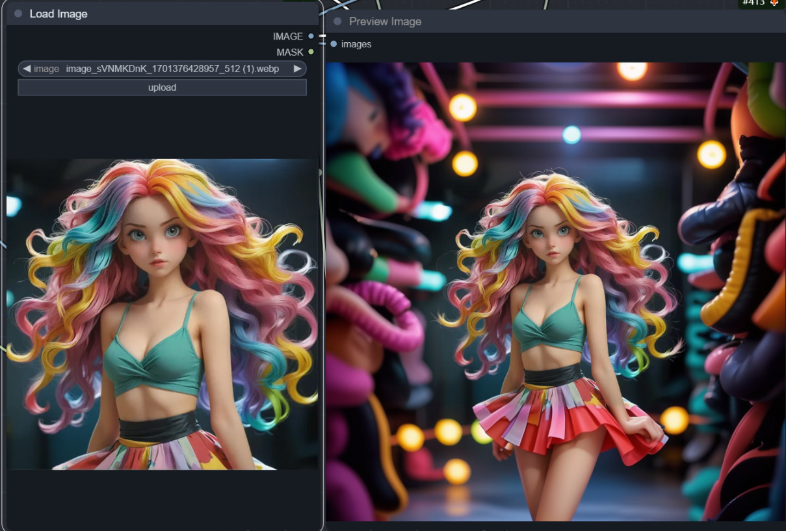

#### Extended image (No prompts needed)

  

Author：Ning

Use controlnet's inpaint model to make guesses about the extensions.At the same time, the style model is used to reference the picture, so that controlnet won't guess wildly.The style model can be either coadapter or IPAdapter, they have different ways to reference the style. I prefer coadapter for extending images.I highly recommend the realisticVisionV60B1VAE model for its great extended image results!

[🔗DOWNLOAD](./extended-image.json)