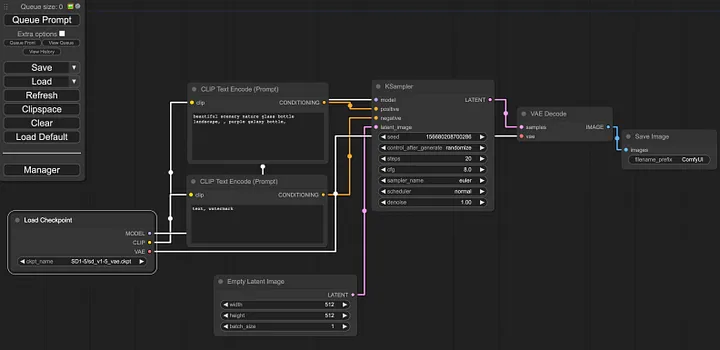
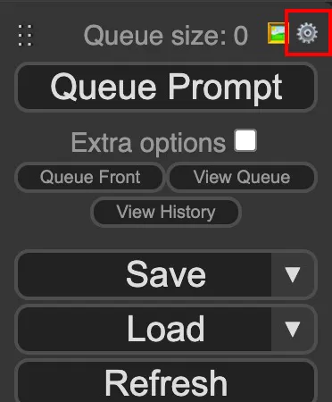
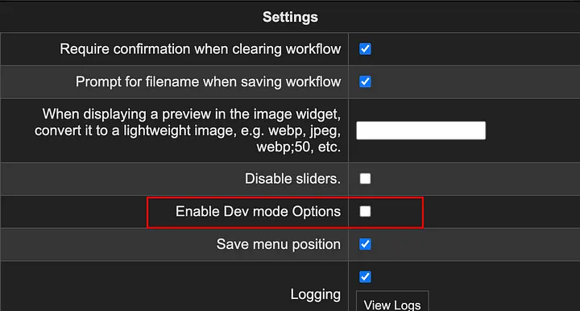
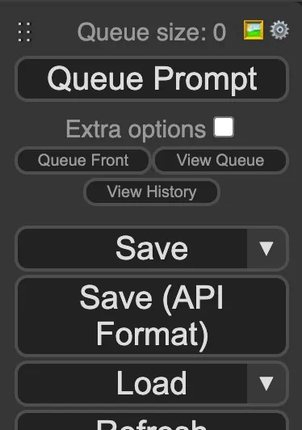
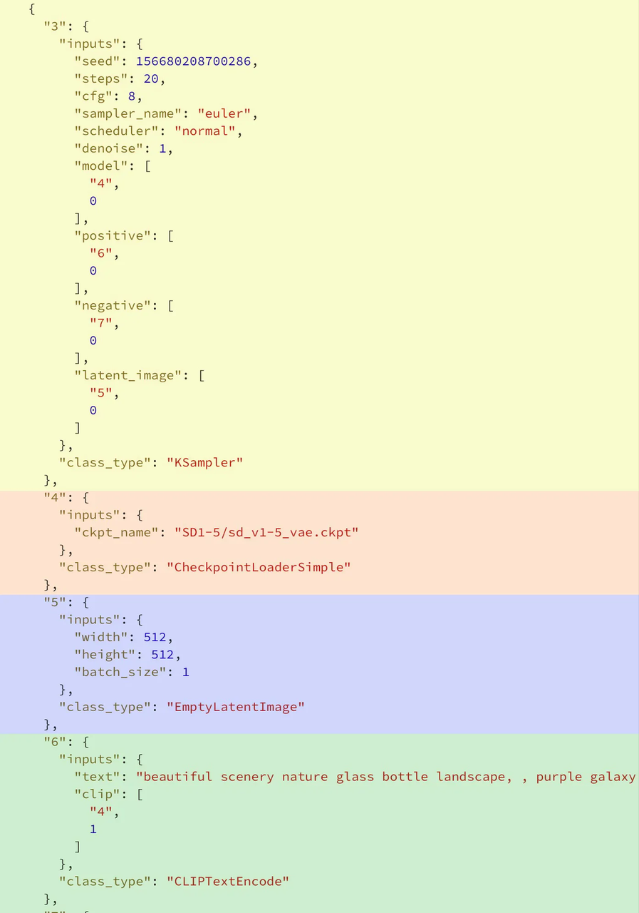

# 适合高级用户的自定义

ComfyUI 的自定义节点引入了直接的 Python 代码，这可能导致安全风险。由于缺乏沙箱/安全机制，自定义节点的代码可以执行任何可能具有恶意意图的操作。

- 提供信任机制
- 提供节点的沙盒版本

## 如何开发自定义节点？

- python 编写节点运行时
- JavaScript 编写节点 UI

你的第一个自定义节点：
https://github.com/shadowcz007/comfyui-mixlab-nodes

前端界面是由 HTML、CSS、Javascript 编写的，每个节点都有自己的一个生命周期管理，例如以下：

### JS 代码示例

```javascript
import { app } from '../scripts/app.js'
const ext = {
  // 扩展的唯一名称
  name: 'Example.LoggingExtension',
  async init(app) {
    // 页面加载后立即运行的任何初始设置
    console.log('[logging]', 'extension init')
  },
  async setup(app) {
    // 应用程序创建后运行的任何设置
    console.log('[logging]', 'extension setup')
  },
  async addCustomNodeDefs(defs, app) {
    // 添加自定义节点定义
    // 这些定义将自动配置和注册
    // defs 是核心节点的查找表，将您的节点添加到其中
    console.log(
      '[logging]',
      'add custom node definitions',
      'current nodes:',
      Object.keys(defs)
    )
  },
  async getCustomWidgets(app) {
    // 返回自定义小部件类型
    // 请参阅 ComfyWidgets 获取小部件示例
    console.log('[logging]', 'provide custom widgets')
  },
  async beforeRegisterNodeDef(nodeType, nodeData, app) {
    // 在节点定义注册到图形之前运行自定义逻辑
    console.log('[logging]', 'before register node: ', nodeType, nodeData)

    // 这将对每个节点定义触发，因此只记录一次
    delete ext.beforeRegisterNodeDef
  },
  async registerCustomNodes(app) {
    //在此处注册任何自定义节点实现，以便比自定义节点定义更灵活。
    console.log('[logging]', 'register custom nodes')
  },
  loadedGraphNode(node, app) {
    // 当加载/拖动/等操作工作流程的 JSON 或 PNG 时，对每个节点触发
    // 如果在后端出现问题并且想要在前端修复工作流程
    // 这就是进行修复的地方
    console.log('[logging]', 'loaded graph node: ', node)

    // This fires for every node on each load so only log once
    delete ext.loadedGraphNode
  },
  nodeCreated(node, app) {
    console.log('[logging]', 'node created: ', node)
    // 每次构建节点时触发
    // 您可以在此处修改小部件、添加处理程序等

    // 这对每个节点触发，所以只记录一次
    delete ext.nodeCreated
  }
}

app.registerExtension(ext)
```

## API 模式的一个简单指南

如何使用 ComfyUI 的 API,通过命令行和脚本控制 ComfyUI

[原文][1]
[代码仓库][2]

> 示例工作流
> 

我们需要启用 Dev Mode. 单击菜单面板右上角的齿轮图标。



查看 Enable Dev mode Options



Save (API Format)菜单面板中应出现一个新按钮。



单击该 Save(API Format)按钮，它将以默认名称保存一个文件 workflow_api.json。使用普通的 ComfyUI 工作流程 json 文件，可以将它们拖放到主 UI 中并加载工作流程。

将 api 格式 json 拖放到 ComfyUI 中不会加载工作流程。它仅包含用于功能目的的足够节点数据，并且不包含位置或布局信息。因此，如果您确实需要可视化并查看工作流程，最好也通过普通按钮保存常规工作流程 json Save。

现在在您选择的文本编辑器中打开此文件。您应该会看到类似于下面的内容。



您可以看到每个部分（为了清晰起见，用彩色表示）都以数字开头。这是 Node ID. 如果您查看第一个节点（黄色），您将看到它的节点 ID 为 ，并且"3"是.KSamplerclass_type

值得注意的是，它们 Node IDs 可能有所不同。如果您从头开始重新构建自己的工作流程并添加、删除节点，那么它们将与此处显示的不同。（ 原始节点不会以 api 格式显示——仅显示核心节点。将来可能会改变）

让我们创建一个名为 的新 Python 脚本 basic_workflow_api.py。

[参考][3]

将提示工作流发送到指定的 URL http://127.0.0.1:8188/prompt 并将其排队到在该地址运行的 ComfyUI 服务器上

> This function sends a prompt workflow to the specified URL
> (http://127.0.0.1:8188/prompt) and queues it on the ComfyUI server
> running at that address.

```python
def queue_prompt(prompt_workflow):
    p = {"prompt": prompt_workflow}
    data = json.dumps(p).encode('utf-8')
    req =  request.Request("http://127.0.0.1:8188/prompt", data=data)
    request.urlopen(req)
```

完成代码后，运行：

```bash
python3 basic_workflow_api.py
```

[1]: https://medium.com/@yushantripleseven/comfyui-using-the-api-261293aa055a
[2]: https://github.com/yushan777/comfyui-api-part1-basic-workflow
[3]: https://github.com/yushan777/comfyui-api-part1-basic-workflow/blob/main/basic_workflow_api.py
