# 核心节点

## 扩散模型加载器

> Diffusers Loader节点（扩散模型加载器），可用于加载扩散模型。

**输入**

- `model_path`：扩散器模型的路径

**输出**

- `MODEL`：用于去噪潜变量的模型。

- `CLIP`：用于编码文本提示的CLIP模型。

- `VAE`：用于将图像编码和解码到潜空间的VAE模型。

 

## 加载检查点节点

> Load Checkpoint (With Config) 节点，可用于根据提供的配置文件加载扩散模型。请注意，通常情况下，常规的Checkpoint能够自动检测出适当的配置。

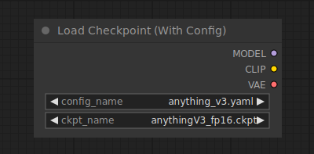

**输入**

- `config_name`：配置文件的名称。

- `ckpt_name`：要加载的模型的名称。

**输出**

- `MODEL`：用于去噪潜变量的模型。

- `CLIP`：用于编码文本提示的CLIP模型。

- `VAE`：用于将图像编码和解码到潜空间的VAE模型。

 

## 条件设定

> 在ComfyUI中，条件设定用于指导扩散模型生成特定的输出。所有的条件设定都以由CLIP使用Clip Text Encode节点嵌入的文本提示开始。

> 这些条件可以通过该部分其他节点的进一步增强或修改。例如，使用Conditioning (Set Area)、Conditioning (Set Mask)或GLIGEN Textbox Apply节点来引导进程朝着特定的构图方向发展。

> 或者通过Apply Style Model、应用ControlNet或 unCLIP Conditioning 节点来提供额外的视觉提示。相关节点的完整列表可以在侧边栏中找到。

## 应用ControlNet模型 Apply ControlNet

> Apply ControlNet节点，可以用于为扩散模型提供进一步的视觉指导。与unCLIP嵌入不同，controlnets 和 T2IAdaptor 适用于任何模型。

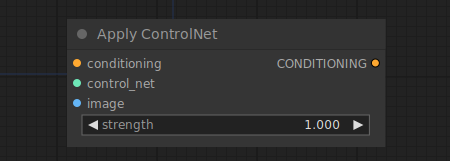

> 通过将多个节点链接在一起，可以使用多个 controlNet 或 T2IAdaptor 来指导扩散模型。例如，可以通过向此节点提供包含边缘检测的图像以及在边缘检测图像上训练的controlNet来提示扩散模型。 

**输入**

- `conditioning`:一个条件

- `control_net`: control_net模型

- `image`:用作扩散模型的视觉指导

**输出**

- `CONDITIONING`:一个包含control_net和视觉指导的条件。

> 提示：要使用T2IAdaptor样式模型，请改用Apply Style Model节点。

 

## 应用风格模型

> Apply Style Model节点是一个用于为扩散模型提供视觉指导的节点，特别是针对所生成图像的样式。该节点使用T2IAdaptor 模型和来自 CLIP_vision 模型的嵌入，将扩散模型引导到与 CLIP_vision 嵌入图像的样式相符的方向。 

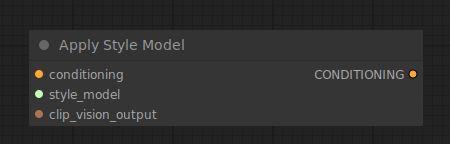

**输入**

- `conditioning`:一个条件

- `style_model`:一个T2I样式适配器

- `CLIP_vision_output`:包含所需样式的图像，由CLIP视觉模型编码

**输出**

- `CONDITIONING`:包含T2I样式适配器和指向所需样式的视觉指导的条件

 

## 设置CLIP最后一层

> 设置CLIP最后一层，CLIP Set Last Layer节点可以用于设置从中获取文本嵌入的CLIP输出层。将文本编码为嵌入是通过将文本通过CLIP模型中的各个层进行转换来实现的。尽管传统上扩散模型是根据CLIP的最后一层的输出进行条件化的，但某些扩散模型是根据较早的层进行条件化的，当使用最后一层的输出时可能效果不佳。

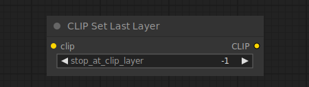

**输入**

- `clip`: 用于编码文本的CLIP模型。

**输出**

- `CLIP`: 设置了新的输出层的CLIP模型。

> 如何理解Clip set last layer的原理？CLIP模型是由OpenAI开发的强大深度学习模型，它结合了视觉和语言理解。它能够以多模态方式理解和生成文本和图像。CLIP由多个层级组成，每个层级比前一个层级更具体。
​

> Clip set last layer 指的是在CLIP模型中在较早的层级停止信息流动，而不是一直到最后一层。通过这样做，您可以控制生成的文本描述的具体程度或准确性。例如，如果您正在寻找一张“牛”的图片，您可能对文本模型能够生成的子类别或具体类型的牛不感兴趣，比如“阿伯丁安格斯公牛”。
​

> 使用 Clip set last layer 的好处在于，它允许您根据特定需求定制生成的文本描述的详细程度。根据应用或任务的不同，您可能希望在某个层级停止，以达到所需的准确性或相关性。例如，如果您有一个关于一个年轻人站在田野上的详细提示，使用较低的CLIP skip层级可能会生成诸如“一个站着的人”，“站着的年轻人”或“站在森林中的年轻人”等描述，每个描述都具有不同的特定程度。
​

> 值得注意的是，Clip set last layer 在与特定方式结构化的模型（如Booru模型）一起使用时特别有用。这些模型通常具有可以分解为多个子标签的标签，从而可以更精细地控制生成的描述。然而，CLIP skip的效果可能因具体的模型和应用而异，可能需要一些试错才能找到最佳设置。
​

> 还值得一提的是，Clip set last layer 仅适用于使用CLIP或基于使用CLIP的模型，如1.x模型及其衍生模型。较新的模型，如2.0模型，使用OpenCLIP而不是CLIP，并且与CLIP的交互方式不同。[知识库](https://t.zsxq.com/13XWLqc5r)
​

## 文本提示

> 输入Prompt（文本提示），CLIP文本编码节点将使用CLIP模型对文本提示进行编码，生成一个嵌入向量，用来指导扩散模型生成特定的图像。

> 有关ComfyUI中所有与文本提示相关的功能的完整指南，[请参阅此页面](https://blenderneko.github.io/ComfyUI-docs/Interface/Textprompts/)。 

**输入**

- `clip` - 用于编码文本的CLIP模型

- `text` - 要编码的文本。 

**输出**

- `CONDITIONING` - 包含嵌入文本的条件，用于指导扩散模型。

## 视觉编码

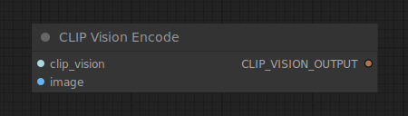

CLIP Vision Encode节点可以使用CLIP视觉模型对图像进行编码，生成可用于指导 unCLIP 扩散模型或作为样式模型输入的嵌入。

**输入**

`clip_vision`

:   用于编码图像的CLIP视觉模型

`image`

:   待编码的图像.

**输出**

`CLIP_VISION_OUTPUT`

:   编码后的图像。

## 平均条件化

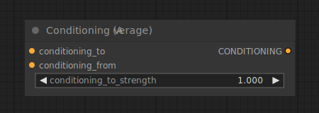

条件化平均节点，Conditioning (Average) 节点可以根据在 conditioning_to_strength 中设置的强度因子，在两个文本嵌入之间进行插值。 

**输入**

`conditioning_to`

:   在 conditioning_to_strength 为1时的文本嵌入的条件化

`conditioning_from`

:  在 conditioning_to_strength 为0时的文本嵌入的条件化。

`conditioning_to_strength`

:   混合 conditioning_to 到 conditioning_from 的因子。 

**输出**

`CONDITIONING`

:   基于 conditioning_to_strength 混合的文本嵌入的新条件化。

## Conditioning (Combine)

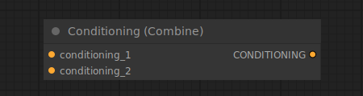

条件化（合并），Conditioning (Combine) 节点可用于通过平均扩散模型的预测噪声来合并多个条件化。请注意，这与 Conditioning (Average) 节点不同。在这里，通过不同条件化（即构成条件化的所有部分）的扩散模型输出进行平均处理，而条件化（平均）节点则插值存储在条件化内部的文本嵌入。

!!! 提示
    尽管 Conditioning Combine 没有一个因素输入来确定如何插值两个结果噪声预测，但可以使用 Conditioning (Set Area) 节点在组合它们之前对各个条件进行加权。

**输入**

`conditioning_1`

:   第一个条件。

`conditioning_2`

:   第二个条件。 

**输出**

`CONDITIONING`

:   一个包含两个输入的新条件，稍后由采样器进行平均。

## Conditioning (Set Area)

Conditioning (Set Area)节点可以用于将条件限制在图像的特定区域内。与Conditioning (Combine)节点一起使用，可以对最终图像的组合进行更多的控制。

!!! 提示
    ComfyUI中坐标系统的原点位于左上角。在混合扩散模型的多个噪声预测之前，强度会被归一化。 

**输入**

`conditioning`

:   将被限制在区域内的条件

`width`

:   区域的宽度

`height`

:   区域的高度

`x`

:   区域的x坐标

`y`

:   区域的y坐标

`strength`

:   当混合多个重叠的条件时使用的区域权重

**输出**

`CONDITIONING`

:   一个新的条件，限制在指定的区域内。

### Conditioning (Set Mask)

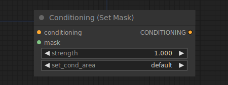

条件化（设置遮罩），Conditioning (Set Mask) 节点可用于将条件化限制在指定的遮罩中。与Conditioning (Combine) 节点一起使用，可以更好地控制最终图像的组合。

!!! 提示
    强度在从扩散模型中混合多个噪声预测之前进行归一化。 

**输入**

`conditioning`

:   限制到遮罩的条件化

`mask`

:   限制条件化的遮罩

`strength`

:   在混合多个重叠条件化时使用的遮罩区域的权重。 

`set_cond_area`

:   是否对整个区域进行去噪，还是限制在遮罩的边界框内。 

**输出**

`CONDITIONING`

:   一个新的条件化，限制在指定的遮罩中。

## example

example usage text with workflow image

### GLIGEN Textbox Apply

应用GLIGEN文本框，GLIGEN Textbox Apply节点可用于为扩散模型提供进一步的空间指导，引导其在图像的特定区域生成指定的部分。尽管文本输入可以接受任何文本，但GLIGEN最适合的输入是文本提示中的一部分对象。

!!! 提示
    ComfyUI中的坐标系原点位于左上角。

**输入**

`conditioning_to`

:   一个条件.

`clip`

:   CLIP模型.

`gligen_textbox_model`

:   GLIGEN模型.

`text`

:   要与空间信息关联的文本

`width`

:   区域的宽度

`height`

:   区域的高度

`x`

:   区域的x坐标

`y`

:   区域的y坐标

**输出**

`CONDITIONING`

:   包含GLIGEN和空间指导的条件。

## example

example usage text with workflow image

# unCLIP Conditioning

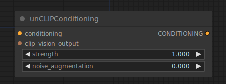

unCLIP条件化，unCLIP Conditioning 节点可以通过由CLIP视觉模型编码的图像为unCLIP模型提供额外的视觉指导。可以链接多个节点以提供多个图像作为指导。

!!! 提示
    并非所有扩散模型都与unCLIP条件化兼容。此节点特别需要使用考虑到unCLIP的扩散模型。

**输入**

`conditioning`

:   条件化

`clip_vision_output`

:   由CLIP VISION模型编码的图像

`strength`

:   unCLIP扩散模型应受图像指导的强度

`noise_augmentation`

:   用于将unCLIP扩散模型引导到原始CLIP视觉嵌入的随机位置，提供与编码图像密切相关的生成图像的额外变化

**输出**

`CONDITIONING`

:   包含unCLIP模型的额外视觉指导的条件化

## 实验性 Experimental

实验性包含实验性节点，可能尚未完全完善。
 
### Load Latent

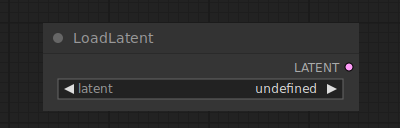

加载潜在节点：Load Latent节点可用于加载使用保存潜在节点保存的潜在图像。 

**输入**

`latent`

:   潜在图像的名称

**输出**

`LATENT`

:   加载的潜在图像

### Save Latent

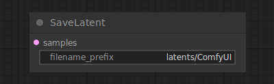

保存潜变量节点：Save Latent节点可以用于保存潜变量以备将来使用。这些潜变量可以使用Load Latent节点再次加载。

**输入**

`samples`

:   要保存的潜变量

`filename_prefix`

:   文件名的前缀

**输出**

此节点没有输出

### Tome Patch Model

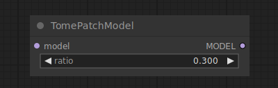

Tome Patch Model节点可以用于对扩散模型应用Tome优化。Tome（TOken MErging）试图找到一种合并提示令牌的方法，以使对最终图像的影响最小化。生成时间更快，所需的VRAM减少，但可能会降低质量。可以通过比率设置来控制此权衡，较高的值会导致合并更多的令牌。

**输入**

`model`

:   要应用Tome优化的扩散模型

`ratio`

:   确定何时合并令牌的阈值

**输出**

`MODEL`

:   经Tome优化的扩散模型

## TokenMerging for Stable Diffusion

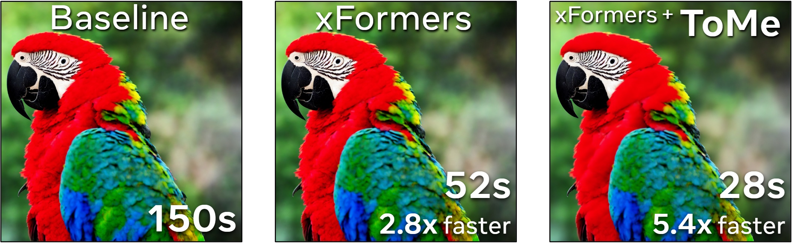

***************

### VAE Decode (Tiled)

VAE解码（平铺），VAE Decode (Tiled) 节点可以使用提供的VAE将潜在空间图像解码回像素空间图像。该节点以平铺方式解码潜在图像，使其能够解码比常规VAE解码节点更大的潜在图像。

!!! 提示
    当因为VRAM不足而导致常规VAE解码节点失败时，comfy将自动使用平铺实现进行重试。

**输入**

`samples`

:   要解码的潜在图像

`vae`

:   用于解码潜在图像的VAE

**输出**

`IMAGE`

:   解码后的图像。

### VAE Encode (Tiled)

VAE编码（平铺），VAE Encode (Tiled) 节点可用于使用提供的VAE将像素空间图像编码为潜在空间图像。此节点使用图块对图像进行编码，使其能够编码比常规VAE编码节点更大的图像。

!!! 提示
    当常规VAE编码节点由于VRAM不足而失败时，Comfy会自动使用平铺实现进行重试。

**输入**

`pixels`

:   像素要编码的像素空间图像

`vae`

:   用于编码像素图像的VAE

**输出**

`LATENT`

:   编码的潜在图像。

## 图像 Image

ComfyUI提供了多种节点来操作像素图像。这些节点可以用于加载图像以进行图像转换工作流，保存结果，或者用于对图像进行高分辨率处理。

### Load Image

加载图像，Load Image节点可用于加载图像。可以通过启动文件对话框或将图像拖放到节点上来上传图像。一旦图像上传完成，就可以在节点内部选择它们。

!!! 提示
默认情况下，图像将上传到ComfyUI的输入文件夹中。 

**输入**

`image`

:   图像要使用的名称。

**输出**

`IMAGE`

:   像素图像。

`MASK`

:   图像的Alpha通道。 

### 示例

为了执行图像到图像的生成，您必须使用加载图像节点加载图像。在下面的示例中，使用加载图像节点加载了一张图像，然后使用 VAE encode 节点将其编码为潜在空间，从而使我们能够执行图像到图像的任务。

(TODO: provide different example using mask)

<!-- 

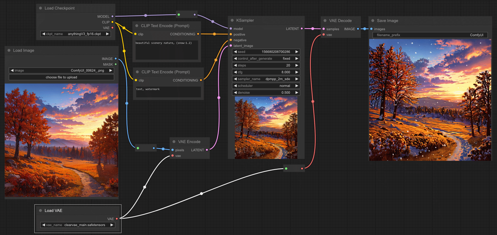

 -->

### Invert Image

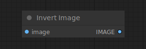

反转图像节点，Invert Image 节点可以用于反转图像的颜色。

**输入**

`image`

:   要反转的像素图像

**输出**

`IMAGE`

:   反转后的像素图像

### Pad Image for Outpainting

Outpainting节点的Pad Image用于给图像添加填充，以进行outpainting。然后，可以通过VAE Encode for Inpainting将此图像输入到inpaint diffusion模型中。

**输入**

`image`

:   要进行填充的图像。 

`left`

:   要在图像左侧填充的量。

`top`

:   要在图像上方填充的量。 

`right`

:   要在图像右侧填充的量。 

`bottom`

:   要在图像下方填充的量。

`feathering`

:   原始图像边界的羽化程度。 

**输出**

`IMAGE`

:   填充后的像素图像。 

`MASK`

:   指示采样器在哪里进行outpainting的掩码。

### Preview Image

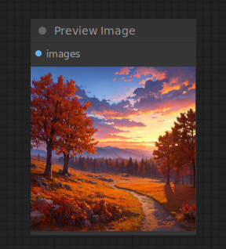
预览图像节点可用于在节点图中预览图像。

**输入**

`image`

:   图像像素数据

**输出**

该节点没有输出参数

### Save Image

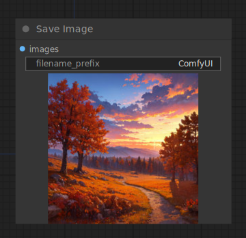{ align=right width=450 }

保存图像：Save Image节点可用于保存图像。要在节点图中简单预览图，请使用Preview Image节点。要更好地组织生成的所有图像，可以将特殊格式的字符串传递给带有file_prefix小部件的输出节点。有关如何格式化字符串的更多信息，[请参阅此页面](https://blenderneko.github.io/ComfyUI-docs/Interface/SaveFileFormatting/)

**输入**

`image`

:   要预览的像素图像

`filename_prefix`

:   要放入文件名中的前缀

**输出**

此节点没有输出。

### Image Blend#postprocessing

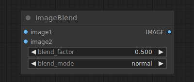

The Image Blend node can be used to blend two images together.

!!! info
    If the dimensions of the second image do not match those of the first it is rescaled and center-cropped to maintain its aspect ratio

**输入**

`image1`

:   A pixel image.

`image2`

:   A second pixel image.

`blend_factor`

:   The opacity of the second image.

`blend_mode`

:   How to blend the images.

**输出**

`IMAGE`

:   The blended pixel image.

### Image Blur

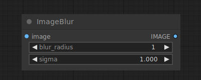 

The Image Blend node can be used to apply a gaussian blur to an image.

**输入**

`image`

:   The pixel image to be blurred.

`blur_radius`

:   The radius of the gaussian.

`sigma`

:   The sigma of the gaussian, the smaller sigma is the more the kernel in concentrated on the center pixel.

**输出**

`IMAGE`

:   The blurred pixel image.

## Image Quantize

The Image Quantize node can be used to quantize an image, reducing the number of colors in the image.

**输入**

`image`

:   The pixel image to be quantized.

`colors`

:   The number of colors in the quantized image.

`dither`

:   Wether to use dithering to make the quantized image look more smooth, or not.

**输出**

`IMAGE`

:   The quantized pixel image.

## Image Sharpen

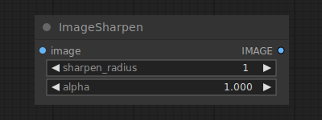

The Image Sharpen node can be used to apply a Laplacian sharpening filter to an image.

**输入**

`image`

:   The pixel image to be sharpened.

`sharpen_radius`

:   The radius of the sharpening kernel.

`sigma`

:   The sigma of the gaussian, the smaller sigma is the more the kernel in concentrated on the center pixel.

`alpha`

:   The strength of the sharpening kernel.

**输出**

`IMAGE`

:   The sharpened pixel image.

## Upscale Image

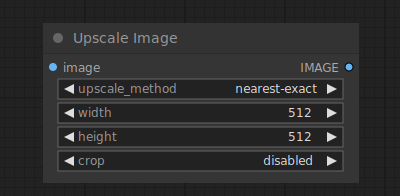 

The Upscale Image node can be used to resize pixel images. To upscale images using AI see the [Upscale Image Using Model](UpscaleImageUsingModel.md) node.

**输入**

`image`

:   The pixel images to be upscaled.

`upscale_method`

:   The method used for resizing.

`Width`

:   The target width in pixels.

`height`

:   The target height in pixels.

`crop`

:   Wether or not to center-crop the image to maintain the aspect ratio of the original latent images.

**输出**

`IMAGE`

:   The resized images.

## Upscale Image (using Model)

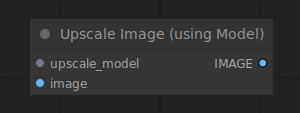

The Upscale Image (using Model) node can be used to upscale pixel images using a model loaded with the [Load Upscale Model]

**输入**

`upscale_model`

:   The model used for upscaling.

`image`

:   The pixel images to be upscaled.

**输出**

`IMAGE`

:   The upscaled images.

## Latent 潜在空间

潜在扩散模型（如稳定扩散）不在像素空间中运作，而是在潜空间中进行去噪。这些节点提供了使用编码器和解码器在像素空间和潜在空间之间切换的方法，并提供了多种操纵潜在图像的方式。

### Empty Latent Image

空潜像图节点，Empty Latent Image节点可用于创建一组新的空潜像图。这些潜像图可以在文本转图像工作流中使用，通过采样器节点对其进行添加噪声和去噪处理。

**输入**

`width`

:   宽度（像素）

`height`

:   高度（像素）；

`batch_size`

:   批次大小（潜在图像数量）。

**输出**

`LATENT`

:   空潜在图像

### Latent Composite

潜在图像合成 Latent Composite节点可用于将一个潜在图像合成到另一个潜在图像中。 

!!! 提示
    ComfyUI中的坐标系统原点位于左上角。 

**输入**

`samples_to`

:   要复合的潜在图像。 

`samples_from`

:   要粘贴的潜在图像。

`x`

:   粘贴潜在图像的x坐标（以像素为单位）。 

`y`

:   粘贴潜在图像的y坐标（以像素为单位）。

`feather`

:   要粘贴的潜在图像的羽化效果。

**输出**

`LATENT`

:   包含将 samples_from 粘贴到 samples_to 中的新潜在图像组合。 

### Latent Composite Masked

潜在图像合成遮罩,Latent Composite Masked节点可用于将一个潜在图像遮罩复合体粘贴到另一个潜在图像。 

**输入**

`destination`

:   目的地：要粘贴的潜在图像。

`source`

:   源：要粘贴的潜在图像。 

`mask`

:   遮罩：要粘贴的源潜在图像的遮罩。 

`x`

:   粘贴潜在图像的x坐标（以像素为单位） 

`y`

:   粘贴潜在图像的y坐标（以像素为单位）

**输出**

`LATENT`

:   将源潜在图像粘贴到目标潜像的组合而成的新潜在图像。

### Upscale Latent

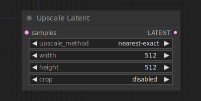

放大潜在图像，Upscale Latent 节点可用于调整潜在图像的大小。

!!! 提示：
    调整潜像图的大小与调整像素图像的大小不同。简单地调整潜像图而不是像素会导致更多的伪影。 

**输入**

`samples`

:   要调整大小的潜像图

`upscale_method`

:   用于调整大小的方法。 

`Width`

:   目标宽度（以像素为单位）。 

`height`

:   目标高度（以像素为单位）。 

`crop`

:   是否居中裁剪图像以保持原始潜像图的纵横比。 

**输出**

`LATENT`

:   调整大小后的潜像图。

### VAE Decode

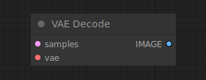

VAE解码，VAE Decode节点可用于使用提供的VAE将潜像图解码为像素图像。 

**输入**

`samples`

:   要解码的潜像图。

`vae`

:   用于解码潜像图的VAE。 

**输出**

`IMAGE`

:   解码后的像素图像。

## example

TODO: SD 1.5 to XL example
<!-- 

 -->

### VAE Encode

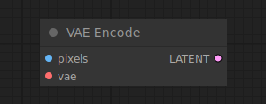

VAE编码，VAE Encode 节点可以使用提供的VAE将像素空间图像编码为潜像图。

**输入**

`pixels`

:   像素：要编码的像素空间图像。

`vae`

:   用于编码像素图像的VAE。

**输出**

`LATENT`

:   编码的潜像图。

## 示例

为了在图像到图像的任务中使用图像，首先需要将其编码为潜像图。在下面的示例中，使用VAE编码节点将像素图像转换为潜像图，以便我们可以将其重新噪声化和去噪，得到全新的图像。

<!-- 

 -->

### Latent From Batch

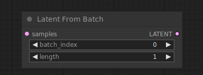 

从批次中提取潜像图，Latent From Batch 节点可以用于从批次中选择一个潜像图或图像片段。这在工作流中需要隔离特定的潜像图或图像时非常有用。

**输入**

`samples`

:   要选择一个片段的批次潜像图。

`batch_index`

:   要选择的第一个潜像图的索引。

`length`

:   要获取的潜像图数量。

**输出**

`LATENT`

:   只包含所选择片段的新批次潜像图

### Rebatch Latents

重新分批潜像图，Rebatch Latents节点可以用于拆分或合并批量的潜在空间图像。当这导致多个批次时，该节点将输出一个批次列表，而不是单个批次。这在批量大小过大无法全部适应VRAM内时非常有用，因为ComfyUI将对列表中的每个批次执行节点，而不是一次执行全部。它还可以将批次列表合并回一个单独的批次中。

**输入**

`samples`

:   待重新分批的潜图。

`batch_size`

:   新的批次大小。

**输出**

`LATENT`

:   一个潜图列表，其中每个批次的大小不超过batch_size。

### Repeat Latent Batch

重复潜在批处理，Repeat Latent Batch节点可用于重复一批潜像图。这可以用于在图像到图像工作流中创建多个图像变体。

**输入**

`samples`

:   要重复的潜像图批处理。

`amount`

:   重复的次数。

**输出**

`LATENT`

:   重复了指定次数的新的潜像图批处理。

### Set Latent Noise Mask

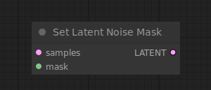

设置潜在噪声掩码，Set Latent Noise Mask节点可用于为修复图像的潜像图添加掩码。当设置了噪声掩码时，采样节点将仅在掩码区域上操作。如果提供了单个掩码，批处理中的所有潜像图都将使用该掩码。

**输入**

`samples`

:   样本：要修复的潜像图。

`mask`

:   掩码：指示修复位置的掩码。

**输出**

`LATENT`

:   潜在：经过掩码处理的潜像图。

### VAE Encode (for Inpainting)

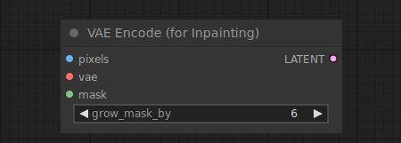

VAE编码（用于修复图像），VAE Encode (for Inpainting) 将像素空间图像编码为潜在空间图像，使用提供的VAE（变分自编码器）。它还接受修复图像的掩码，指示采样节点应该对图像的哪些部分去噪。可以使用grow_mask_by来增加掩码区域的大小，为修复过程提供一些额外的填充区域。

!!! 提示
    该节点专门用于用于修复训练的扩散模型，并确保在编码之前，掩码下方的像素被设置为灰色（0.5,0.5,0.5）。

**输入**

`pixels`

:   像素：要编码的像素空间图像。

`vae`

:   用于编码像素图像的VAE。

`mask`

:   掩码：指示要修复的位置的掩码。

`grow_mask_by`

:   增加给定掩码区域的大小。

**输出**

`LATENT`

:   掩码和编码的潜像图。

### Crop Latent

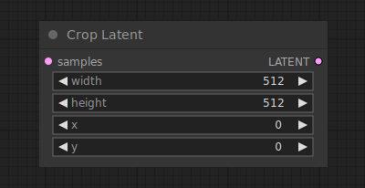 

裁剪潜像，Crop latent 节点可用于将潜像裁剪到新的形状。

**输入**

`samples`

:   样本要裁剪的潜像。

`width`

:   宽度以像素为单位的区域宽度。

`height`

:   高度以像素为单位的区域高度。

`x`

:   以像素为单位的区域x坐标。

`y`

:   以像素为单位的区域y坐标。

**输出**

`LATENT`

:   裁剪后的潜像图。

### Flip Latent

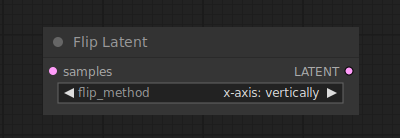 

翻转潜像，Flip Latent 节点可用于水平或垂直翻转潜像。

**输入**

`samples`

:   要翻转的潜像。

`flip_method`

:   选择水平翻转或垂直翻转

**输出**

`LATENT`

:   翻转后的潜像图。

### Rotate Latent

The Rotate Latent node can be used to rotate latent images clockwise in increments of 90 degrees.

**输入**

`samples`

:   The latent images to be rotated.

`rotation`

:   Clockwise rotation.

**输出**

`LATENT`

:   The rotated latents.

## 载入器 Loaders

The loaders in this segment can be used to load a variety of models used in various workflows. A full list of all of the loaders can be found in the sidebar.

### GLIGEN Loader

The GLIGEN Loader node can be used to load a specific GLIGEN model. GLIGEN models are used to associate spatial information to parts of a text prompt, guiding the diffusion model to generate images adhering to compositions specified by GLIGEN.

**输入**

`gligen_name`

:   The name of the GLIGEN model.

**输出**

`GLIGEN`

:   The GLIGEN model used to encode spatial information to parts of the text prompt.

### Hypernetwork Loader

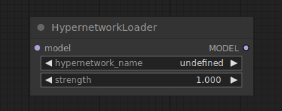

The Hypernetwork Loader node can be used to load a hypernetwork. similar to LoRAs, they are used to modify the diffusion model, to alter the way in which latents are denoised. Typical use-cases include adding to the model the ability to generate in certain styles, or better generate certain subjects or actions. One can even chain multiple hypernetworks together to further modify the model.

!!! tip

    Hypernetwork strength values can be set to negative values. At times this can result in interesting effects.

## inputs

`model`

:   A diffusion model.

`hypernetwork_name`

:   The name of the hypernetwork.

`strength`

:   How strongly to modify the diffusion model. This value can be negative.

## outputs

`MODEL`

:   The modified diffusion model.

### Load Checkpoint

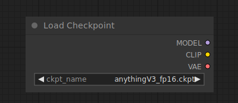

The Load Checkpoint node can be used to load a diffusion model, diffusion models are used to denoise latents. This node will also provide the appropriate VAE and CLIP model.

## inputs

`ckpt_name`

:   The name of the model.

## outputs

`MODEL`

:   The model used for denoising latents.

`CLIP`

:   The CLIP model used for encoding text prompts.

`VAE`

:   The VAE model used for encoding and decoding images to and from latent space.

### Load CLIP

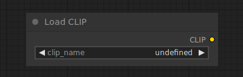

The Load CLIP node can be used to load a specific CLIP model, CLIP models are used to encode text prompts that guide the diffusion process.

!!! warning

    Conditional diffusion models are trained using a specific CLIP model, using a different model than the one which it was trained with is unlikely to result in good images. The [Load Checkpoint](LoadCheckpoint.md) node automatically loads the correct CLIP model.

## inputs

`clip_name`

:   The name of the CLIP model.

## outputs

`CLIP`

:   The CLIP model used for encoding text prompts.

### Load CLIP Vision

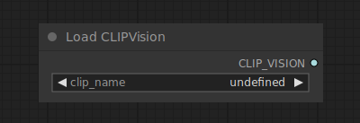

The Load CLIP Vision node can be used to load a specific CLIP vision model, similar to how CLIP models are used to encode text prompts, CLIP vision models are used to encode images.

## inputs

`clip_name`

:   The name of the CLIP vision model.

## outputs

`CLIP_VISION`

:   The CLIP vision model used for encoding image prompts.

### Load ControlNet Model

The Load ControlNet Model node can be used to load a ControlNet model. Similar to how the CLIP model provides a way to give textual hints to guide a diffusion model, ControlNet models are used to give visual hints to a diffusion model. This process is different from e.g. giving a diffusion model a partially noised up image to modify. Instead ControlNet models can be used to tell the diffusion model e.g. where edges in the final image should be, or how subjects should be posed. This node can also be used to load T2IAdaptors.

## inputs

`control_net_name`

:   The name of the ControlNet model.

## outputs

`CONTROL_NET`

:   The ControlNet or T2IAdaptor model used for providing visual hints to a diffusion model.

### Load LoRA

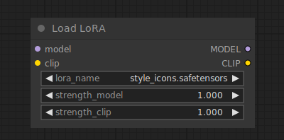

The Load LoRA node can be used to load a LoRA. LoRAs are used to modify the diffusion and CLIP models, to alter the way in which latents are denoised. Typical use-cases include adding to the model the ability to generate in certain styles, or better generate certain subjects or actions. One can even chain multiple LoRAs together to further modify the model.

!!! tip

    LoRA strength values can be set to negative values. At times this can result in interesting effects.

## inputs

`model`

:   A diffusion model.

`clip`

:   A CLIP model.

`lora_name`

:   The name of the LoRA.

`strength_model`

:   How strongly to modify the diffusion model. This value can be negative.

`strength_clip`

:   How strongly to modify the CLIP model. This value can be negative.

## outputs

`MODEL`

:   The modified diffusion model.

`CLIP`

:   The modified CLIP model.

### Load Style Model

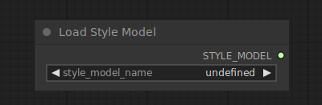

The Load Style Model node can be used to load a Style model. Style models can be used to provide a diffusion model a visual hint as to what kind of style the denoised latent should be in.

!!! info
    Only T2IAdaptor style models are currently supported

## inputs

`style_model_name`

:   The name of the style model.

## outputs

`STYLE_MODEL`

:   The style model used for providing visual hints about the desired style to a diffusion model.

### Load Upscale Model

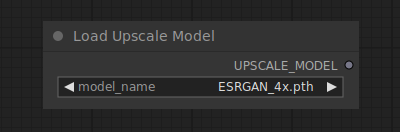

The Load Upscale Model node can be used to load a specific upscale model, upscale models are used to upscale images.

## inputs

`model_name`

:   The name of the upscale model.

## outputs

`UPSCALE_MODEL`

:   The upscale model used for upscaling images.

### Load VAE

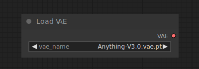

The Load VAE node can be used to load a specific VAE model, VAE models are used to encoding and decoding images to and from latent space. Although the [Load Checkpoint](LoadCheckpoint.md) node provides a VAE model alongside the diffusion model, sometimes it can be useful to use a specific VAE model.

## inputs

`vae_name`

:   The name of the VAE.

## outputs

`VAE`

:   The VAE model used for encoding and decoding images to and from latent space.

## example

At times you might wish to use a different VAE than the one that came loaded with the [Load Checkpoint](./LoadCheckpoint.md) node. In the example below we use a different VAE to encode an image to latent space, and decode the result of the Ksampler.

<!-- 

 -->

### unCLIP Checkpoint Loader

The unCLIP Checkpoint Loader node can be used to load a diffusion model specifically made to work with unCLIP. unCLIP Diffusion models are used to denoise latents conditioned not only on the provided text prompt, but also on provided images. This node will also provide the appropriate VAE and CLIP amd CLIP vision models.

!!! warning
    even though this node can be used to load all diffusion models, not all diffusion models are compatible with unCLIP.

## inputs

`ckpt_name`

:   The name of the model.

## outputs

`MODEL`

:   The model used for denoising latents.

`CLIP`

:   The CLIP model used for encoding text prompts.

`VAE`

:   The VAE model used for encoding and decoding images to and from latent space.

`CLIP_VISION`

:   The CLIP Vision model used for encoding image prompts.

## 遮罩 Mask
Masks provide a way to tell the sampler what to denoise and what to leave alone. These nodes provide a variety of ways create or load masks and manipulate them.

### 将图像转换为遮罩

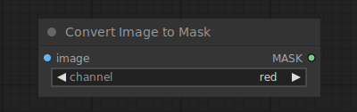

将图像转换为遮罩节点允许用户从图像的特定通道创建遮罩。这对于想要控制图像特定区域的编辑或处理特别有用，例如只对图像的某一部分应用效果或调整。

**输入**

`image`

:   要转换为遮罩的像素图像。

`channel`

:   要用作遮罩的通道。

**输出**

`MASK`

:   由图像通道创建的遮罩。

## 示例

将图像转换为遮罩的操作非常直接。首先，你需要准备一个图像，并确定你想要用作遮罩的特定通道。以下是一个简单的工作流程示例：

1. 将你想要转换的图像连接到`image`输入。
2. 选择你想要用作遮罩的通道（红色、绿色、蓝色或透明度）。
3. 节点将处理输入的图像，并在`MASK`输出中提供相应通道的遮罩。

这在许多图像处理任务中都非常有用，特别是在需要精确控制应用于图像哪个部分的效果时。

<!-- 

 -->

这样，你就可以利用图像的不同通道来创建精确的遮罩，进一步提高你的图像编辑能力和精度。

### 裁剪遮罩

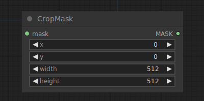

裁剪遮罩节点用于将遮罩裁剪为新的形状。通过定义裁剪区域的尺寸和坐标，你可以精确控制保留遮罩的哪一部分。

!!! info
    在ComfyUI中，坐标系的原点位于左上角。

## 输入

`mask`

:   要裁剪的遮罩。

`width`

:   裁剪区域的宽度，以像素为单位。

`height`

:   裁剪区域的高度，以像素为单位。

`x`

:   裁剪区域的x坐标，以像素为单位。

`y`

:   裁剪区域的y坐标，以像素为单位。

## 输出

`MASK`

:   被裁剪后的遮罩。

## 示例

裁剪遮罩是图像编辑中常用的一项功能，它可以帮助你从一个大的遮罩中精确地选出你需要的部分。以下是如何使用裁剪遮罩节点的一个简单示例：

1. 将你想要裁剪的遮罩连接到`mask`输入。
2. 设置`width`和`height`来确定裁剪区域的尺寸。
3. 通过`x`和`y`输入来定位裁剪区域的左上角起始点。
4. 节点将输出一个新的、按照你指定参数裁剪过的遮罩。

<!-- 

 -->

此裁剪遮罩可用于去除不需要的部分，或者将焦点集中在遮罩的特定区域。

### 羽化遮罩

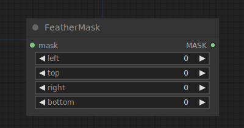

羽化遮罩节点用于对遮罩进行羽化处理，使遮罩边缘更加柔和，以实现更自然的过渡。

## 输入

`mask`

:   需要进行羽化处理的遮罩。

`left`

:   左侧边缘的羽化量。

`top`

:   顶部边缘的羽化量。

`right`

:   右侧边缘的羽化量。

`bottom`

:   底部边缘的羽化量。

## 输出

`MASK`

:   经过羽化处理的遮罩。

## 示例

羽化遮罩是在图像处理和合成中实现柔和边缘效果的重要工具，特别是当将两个图像层叠加或融合时，羽化可以使边缘之间的过渡更加自然。以下是一个简单的使用案例：

1. 将您想要羽化的遮罩连接到`mask`输入。
2. 根据需要设置`left`、`top`、`right`和`bottom`，这些值确定了各个方向上羽化效果的强度。
3. 节点会生成一个新的羽化遮罩，可以被进一步用在图像融合或其他视觉效果中。

<!-- 

 -->

此羽化遮罩可用于平滑遮罩的硬边缘，避免图像合成时出现不自然的硬线条或过渡。

### 反转遮罩

反转遮罩节点用于反转一个遮罩，将原本的掩盖区域转换为非掩盖区域，反之亦然。这在您希望改变遮罩影响区域时非常有用。

## 输入

`mask`

:   需要被反转的遮罩。

## 输出

`MASK`

:   被反转后的遮罩。

## 实例

反转遮罩节点在各种情境下都非常有用，尤其是当您希望对图像的不同部分应用不同的效果或处理时。以下是一个简单的使用案例：

在这个工作流中，我们首先加载一个遮罩，该遮罩原本是为了保护图像的一个区域而创建的。但在某一步骤，我们决定想对原本被保护的区域应用某种效果（比如去噪或滤镜），同时保持原本未被保护的区域不变。这时，我们就可以使用反转遮罩节点。

1. 加载您原本的遮罩到工作流。
2. 将遮罩连接到“反转遮罩”节点的输入端。
3. 将“反转遮罩”节点的输出连接到您的图像处理节点（比如 KSampler）。

现在，原本被保护的区域将接受处理，而其他区域则保持不变。

<!-- 

 -->

通过使用反转遮罩节点，您能轻松地在不同的图像编辑阶段切换受影响的区域，无需创建和加载多个遮罩文件。

### 加载图片（作为遮罩）

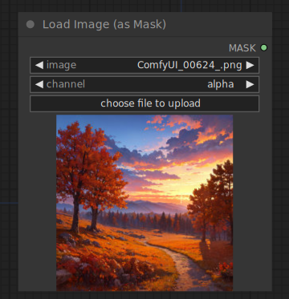

加载图片（作为遮罩）节点可以用来加载图片的某个通道并将其作为遮罩使用。图片可以通过启动文件对话框上传，或者直接拖拽到节点上。一旦图片上传，就可以在节点内部选择使用。

!!! info
    默认情况下，图片会被上传到ComfyUI的输入文件夹

## 输入

`image`

:   要转换为遮罩的图片的名称。

`channel`

:   要用作遮罩的图片的通道。

## 输出

`MASK`

:   从图片通道创建的遮罩。

## 实例

加载图片作为遮罩的节点在您需要基于现有图像创建遮罩时非常有用，尤其是当图像的某个区域有独特的颜色或亮度时，可以通过该颜色或亮度区分进行遮罩。以下是一个简单的使用案例：

在此工作流中，我们有一个图像，其中某个区域我们想要进行特殊处理（例如应用特效、调整或变换），而不影响图像的其他部分。

1. 使用“加载图片（作为遮罩）”节点，选择您的图片文件。
2. 在“通道”选项中，选择一个特定的颜色通道（红色、绿色、蓝色或透明度），这取决于您的图片和需要遮罩的区域。例如，如果需要遮罩的区域在红色通道上有高亮度，则选择红色通道。
3. 将此节点的输出连接到下一个处理节点的遮罩输入，例如，一个应用特效的节点。

现在，您的特效或处理将只应用于基于所选图片通道生成的遮罩的区域。

<!-- 

 -->

这种方法提供了一种简便的方式，通过现有图片快速创建遮罩，无需手动绘制复杂的遮罩形状。

### 遮罩合成

遮罩合成节点可以用来将一个遮罩粘贴到另一个遮罩中。

!!! info
    在ComfyUI中，坐标系统的原点位于左上角。

## 输入

`destination`

:   将要被粘贴的遮罩。

`source`

:   要粘贴的遮罩。

`x`

:   粘贴遮罩的x坐标，单位为像素。

`y`

:   粘贴遮罩的y坐标，单位为像素。

`operation`

:   粘贴遮罩的方式。

## 输出

`MASK`

:   包含粘贴到`destination`中的`source`的新遮罩合成。

## 示例

遮罩合成节点非常适用于需要将一个遮罩层叠到另一个上的场景，尤其是当您想要在图像的特定部分应用不同的效果或调整时。以下是一个简单的使用案例：

在此工作流中，我们有两个遮罩 - 一个是主遮罩（destination），另一个我们希望粘贴到主遮罩上的次遮罩（source）。

1. 将主遮罩连接到`destination`输入。
2. 将要粘贴的遮罩连接到`source`输入。
3. 在`x`和`y`输入中设置坐标，确定次遮罩在主遮罩上的位置。
4. 选择`operation`以确定粘贴时如何合并遮罩。例如，“正常”会简单地将次遮罩放在主遮罩上，“相加”会合并遮罩的亮度值等。

输出的遮罩将是次遮罩粘贴到主遮罩上的结果，根据所选择的操作方式，可能会有不同的视觉效果。

此节点非常适用于复杂的图像处理任务，其中需要精确控制应用于图像不同部分的效果。
<!-- 

 -->

这种方法提供了一种高度可定制的方式来合并遮罩，为图像编辑提供更多的灵活性和控制。

### 纯色遮罩 Solid Mask

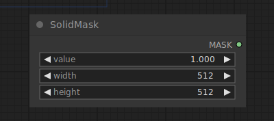

纯色遮罩节点可以用来创建一个填充了单一值的纯色遮罩。

## 输入

`value`

:   填充遮罩的值。

`width`

:   遮罩的宽度。

`height`

:   遮罩的高度。

## 输出

`MASK`

:   填充了单一值的遮罩。

## 示例

纯色遮罩节点在您需要为整个图像或特定区域创建统一遮罩时非常有用，尤其是在需要遮蔽背景或仅对图像的特定部分应用效果时。以下是一个简单的使用案例：

1. 将您想要填充的值输入到`value`中，该值范围从0（完全透明）到1（完全不透明）。
2. 输入您期望的遮罩`width`和`height`，通常这会与您工作的图像尺寸相匹配。
3. 节点会生成一个填充了所选值的纯色遮罩，可以被应用到其他节点，例如遮罩合成节点或KSampler节点。

<!-- 

 -->

这个纯色遮罩可以用作其他遮罩操作的基础，或者直接用来控制图像的哪些部分应该被采样器处理或保留。

## 采样 Sampling

采样节点提供了一种使用扩散模型对潜在图像进行去噪的方法。

<!--- 有关可用的时间表和采样器的概览
todo: explanation about available samplers, schedules and appropriate numbers of steps
-->

### KSampler

KSampler 使用提供的模型以及正向和负向条件来生成给定潜像的新版本。首先，根据给定的 `seed` 和 `denoise` 强度对潜像进行加噪，部分擦除潜像。然后使用给定的 `Model` 以及 `positive` 和 `negative` 条件作为指导，去除这些噪声，在噪声擦除图像的地方“构想”新的细节。

## 输入

`Model`

:   用于去噪的模型

`Positive`

:   正面调节。

`Negative`

:   负面调节。

`latent_image`

:   将被去噪的潜像。

`seed`

:   用于创建噪声的随机种子。

`control_after_generate`

:   提供在每个提示后更改上述种子号的能力。节点可以`randomize`、`increment`、`decrement`或保持种子号`fixed`。

`steps`

:   去噪期间使用的步骤数。允许采样器进行的步骤越多，结果就越准确。有关如何选择适当步骤数的好的指导方针，请参见[samplers](samplers.md)页面。

`cfg`

:   无分类器指导(cfg)比例决定了采样器在实现提示内容到最终图像中应该有多积极。更高的比例迫使图像更好地代表提示，但设置过高的比例会对图像的质量产生负面影响。

`sampler_name`

:   要使用的采样器，有关可用采样器的更多详细信息，请参见[samplers](samplers.md)页面。

`scheduler`

:   要使用的计划类型，有关可用计划的更多详细信息，请参见[samplers](samplers.md)页面。

`denoise`

:   应该有多少潜像信息被噪声擦除。

## 输出

`LATENT`

:   去噪后的潜像。

## 示例

KSampler 是任何工作流的核心，可用于执行文本到图像和图像到图像的生成任务。下面的示例展示了如何在图像到图像任务中使用 KSampler，通过连接一个模型、一个正面和负面嵌入以及一个潜像。注意，我们使用的去噪值小于1.0。这样，在对原始图像进行加噪时，原始图像的部分内容得以保留，指导去噪过程生成相似的图像。

<!-- 

 -->

### KSampler 高级

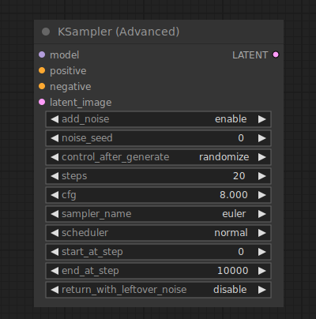

KSampler Advanced节点是[KSampler](KSampler.md)节点的更高级版本。尽管KSampler节点总是向潜像中添加噪声，然后完全去除加噪后的潜像，但KSampler Advanced节点提供了额外的设置来控制这种行为。可以通过`add_noise`设置告诉KSampler Advanced节点不向潜像中添加噪声。它还可以通过`return_with_leftover_noise`设置返回部分去噪后的图像。与KSampler节点不同，此节点没有`denoise`设置，但这个过程是由`start_at_step`和`end_at_step`设置控制的。这使得例如将部分去噪的潜在图像交给另一个KSampler Advanced节点来完成过程成为可能。

!!! 提示

    假设`end_at_step >= steps`，KSampler Advanced节点将以与KSampler节点具有以下`denoise`设置的完全相同的方式去噪潜像：

    `denoise = (steps - start_at_step) / steps`

## 输入

`Model`

:   用于去噪的模型

`Positive`

:   正面调节。

`Negative`

:   负面调节。

`latent_image`

:   将被去噪的潜像。

`add_noise`

:   是否在去噪前向潜像中添加噪声。启用时，节点将为给定的起始步骤注入适当的噪声。

`seed`

:   用于创建噪声的随机种子。

`control_after_generate`

:   提供在每个提示后更改上述种子号的能力。节点可以`randomize`、`increment`、`decrement`或保持种子号`fixed`。

`steps`

:   计划中的步骤数。允许采样器进行的步骤越多，结果就越准确。有关如何选择适当步骤数的好的指导方针，请参见[samplers](samplers.md)页面。

`cfg`

:   无分类器指导(cfg)比例决定了采样器在实现提示内容到最终图像中应该有多积极。更高的比例迫使图像更好地代表提示，但设置过高的比例会对图像的质量产生负面影响。

`sampler_name`

:   要使用的采样器，有关可用采样器的更多详细信息，请参见[samplers](samplers.md)页面。

`scheduler`

:   要使用的计划类型，有关可用计划的更多详细信息，请参见[samplers](samplers.md)页面。

`start_at_step`

:   确定在计划的哪一步开始去噪过程。

`end_at_step`

:   确定在哪一步结束去噪。当此设置超过`steps`时，计划将在`steps`处结束

`return_with_leftover_noise`

:   禁用时，KSampler Advanced将尝试在最后一步完全去除潜像中的噪声。根据此操作跳过计划中的多少步骤，输出可能不准确且质量较低。

## 输出

`LATENT`

:   去噪后的潜像。

