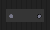
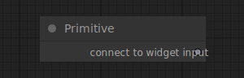
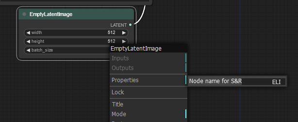

# ComfyUI interface stuff

## Textprompts 文本提示

ComfyUI 提供了多种方式来微调您的提示，以更好地反映您的意图。

### 提高和降低权重

通过使用以下语法将提示的指定部分括在括号中，可以提高或降低提示部分的重要性：`(prompt:weight)`。例如，如果我们有一个提示 `flowers inside a blue vase`，并且我们希望扩散模型强调花卉，我们可以尝试将我们的提示改写为：`(flowers:1.2) inside a blue vase`。嵌套循环会相乘它们内部的权重，例如在提示 `((flowers:1.2):.5) inside a blue vase` 中，花朵最终获得 0.6 的权重。仅使用括号而不指定权重是 `(prompt:1.1)` 的简写，例如 `(flower)` 等于 `(flower:1.1)`。要在提示中使用括号，它们必须被转义，例如 `\(1990\)`。ComfyUI 也可以通过快捷键 *ctrl+arrow-up* 和 *ctrl+arrow-down* 为提示的选定部分添加适当的加权语法。这些快捷方式提高或降低权重的量可以在设置中调整。

### 使用文本反转嵌入

文本反转是定制的 CLIP 嵌入，体现了某些概念。可以通过使用以下语法在提示中引用文本反转：`embedding:name`，其中 name 是嵌入文件的名称。

### 添加随机选择

可以让 ComfyUI 在排队时使用以下语法随机选择提示的某些部分：`{choice1|choice2|...}`。例如，如果我们想让 ComfyUI 随机选择一组颜色中的一种，我们可以在我们的提示中添加以下内容：`{red|blue|yellow|green}`。

## UtilityNodes 实用节点

ComfyUI 附带了一组节点，帮助管理图形。

### Reroute 重新路由

重新路由节点可用于重新路由链接，这对于组织您的工作流程很有用。

重新路由节点上的输入和输出也可以垂直放置

### Primitive 原始

原始节点可以用于...

## NodeOptions

## SaveFileFormatting 保存文件格式

跟踪你生成的所有图片可能会很困难。为了帮助组织您的图像，您可以向带有 `file_prefix` 小部件的输出节点传递特殊格式的字符串。

### 查找和替换字符串

为了自动将某些节点小部件的值插入到文件名中，可以使用以下语法：`%node_name.widget_name%`。例如，如果我们希望基于每个分辨率存储图像，我们可以向节点提供以下字符串：`%Empty Latent Image.width%x%Empty Latent Image.height%/image`。这些字符串将被指定的节点值替换。

### 重命名节点以进行搜索和替换

有时，节点名称可能相当大，或者多个节点可能共享相同的名称。在这些情况下，可以在节点选项菜单下的 `properties>Node name for S&R` 中指定一个特定的名称。

## 日期时间字符串

ComfyUI 也可以插入日期信息，格式为 `%date:FORMAT%`，其中格式识别以下说明符：

| 说明符         | 描述 |
| -------------- | ---- |
| `d` 或 `dd`    | 日   |
| `M` 或 `MM`    | 月   |
| `yy` 或 `yyyy` | 年   |
| `h` 或 `hh`    | 小时 |
| `m` 或 `mm`    | 分钟 |
| `s` 或 `ss`    | 秒   |

## 快捷键

ComfyUI 提供了以下快捷键，您可以使用它们来加快工作流程：

| 快捷键               | 说明                             |
| -------------------- | -------------------------------- |
| *ctrl+enter*       | 将当前图形排入生成队列           |
| *ctrl+shift+enter* | 将当前图形作为第一个排入生成队列 |
| *ctrl+s*           | 保存工作流                       |
| *ctrl+o*           | 载入工作流                       |
| *ctrl+a*           | 选择所有节点                     |
| *ctrl+m*           | 静音/取消静音所选节点            |
| *delete*           | 删除所选节点                     |
| *backspace*        | 删除所选节点                     |
| *ctrl+delete*      | 删除当前图形                     |
| *ctrl+backspace*   | 删除当前图形                     |
| *space*            | 按住并移动光标时移动画布         |
| *ctrl+lbutton*     | 将点击的节点添加到选择           |
| *shift+lbutton*    | 将点击的节点添加到选择           |
| *ctrl+c*           | 复制所选节点                     |
| *ctrl+v*           | 粘贴所选节点同时断开连接         |
| *ctrl+shift+v*     | 粘贴所选节点同时保持传入连接     |
| *shift+lbutton*    | 按住并拖动以同时移动多个所选节点 |
| *ctrl+d*           | 载入默认图形                     |
| *q*                | 切换队列的可见性                 |
| *h*                | 切换历史记录的可见性             |
| *r*                | 刷新图形                         |
| 2 X *lbutton*      | 双击打开节点快速搜索调色板       |
| *rbutton*          | 打开节点菜单                     |
