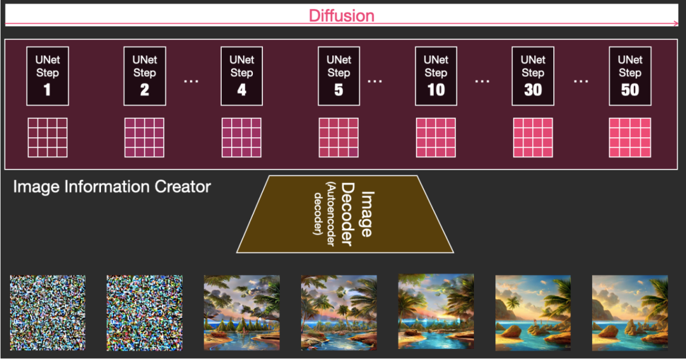

---
---

# 教程

> ComfyUI 是一个强大且模块化的稳定扩散 GUI 和后端。我们基于[ComfyUI 官方仓库](https://github.com/comfyanonymous/ComfyUI) ，专门针对中文用户，做了优化和文档的细节补充。

本教程的目标是帮助您快速上手 ComfyUI，运行您的第一个工作流，并为探索下一步提供一些参考指南。

## 安装

安装方式，推荐使用官方的 [Window-Nvidia 显卡-免安装包](https://github.com/comfyanonymous/ComfyUI/releases/download/latest/ComfyUI_windows_portable_nvidia_cu121_or_cpu.7z) ,也可以从 [百度网盘](链接：https://pan.baidu.com/s/14hmH-NA_d5lObYNQAehKTQ?pwd=MAI0) 下载

如果你是 Mac 或者 Linux 系统，请参考 GitHub 上的[安装说明](https://github.com/comfyanonymous/ComfyUI#installing)。

### 什么是 stable diffusion？

Stable Diffusion，中文一般称为稳定扩散，是 2022 年发布的深度学习生成模型，它可以根据文本的描述产生详细的图像。Stable Diffusion 通过一个复杂的概率扩散过程，逐步将原始图像转换为具有特定特征的图像，实现图像生成。

### 下载模型

如果您完全不了解任何与稳定扩散相关的内容，您要做的第一件事就是获取一个模型*checkpoints*，您将用它来生成图像。

您可以在[CivitAI](https://civitai.com/) 或 [HuggingFace](https://huggingface.co/models?other=stable-diffusion) 等网站上找到多种模型。首先，获取您喜欢的模型*checkpoints*，并将其放置在`ComfyUI/models/checkpoints`中。

## 启动 ComfyUI

双击*run_nvidia_gpu.bat* 启动 ComfyUI。

启动后，你将看到 ComfyUI 的提示：

请在浏览器里访问 [http://127.0.0.1:8188](http://127.0.0.1:8188) 访问

### Comfy 的第一步

此时，您应该已经在浏览器标签中启动并运行了 ComfyUI。第一次使用，ComfyUI 加载的是一个默认的工作流。这是一个最基础的 text-to-image 的工作流。

您可以拖动画布，或者按住空格键并移动鼠标。可以通过鼠标滚动来缩放。

如果您弄乱了什么，只需在右边的菜单中点击`Load Default`将其重置为初始状态。

在我们运行工作流之前，让我们进行一个小修改，以预览生成的图像而不保存它们：

1. 右键单击`Save Image`节点，然后选择`Remove`。
1. 双击画布的空白部分，输入`preview`，然后单击`PreviewImage`选项。
1. 找到`VAE Decode`节点的`IMAGE`输出，并将其连接到您刚添加的`Preview Image`节点的`images`输入。

此修改将预览您的结果，而不会将结果保存到*output*文件夹里。

通过在菜单中点击`Queue Prompt`或在键盘上按*command+enter* 或 *control+enter*来创建您的第一张图片，就是这样！

## 尝试其他工作流

为了便于分享，ComfyUI 默认将工作流的详细信息存储在生成的 PNG 中。要加载生成图像的工作流，只需通过菜单中的`Load`按钮加载图像（或者是 JSON 文件），或将其拖放到 ComfyUI 窗口中。ComfyUI 将自动解析工作流的详细信息并加载所有相关节点及其设置。

在那里可以获得更多的工作流？可以访问[ComfyUI 的官方示例工作流](https://comfyanonymous.github.io/ComfyUI_examples/)

## 进一步的支持

欢迎申请加入[ComfyUI 中文社区](https://docs.qq.com/form/page/DU2pRVE5OUmZ6amNj)

访问由 Mixlab Nodes 维护的[discord 交流频道](https://discord.gg/cXs9vZSqeK)
